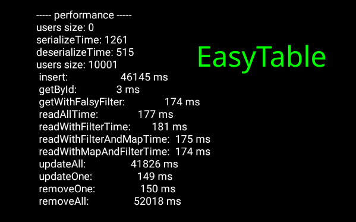
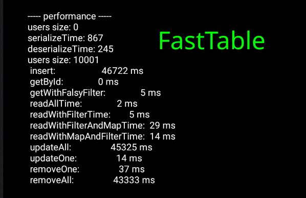

# EasyDataAndroid

<center><br></center>

[](https://www.jitpack.io/#ali77gh/EasyDataAndroid) <br>


Painless android library for working with files and database in easiest way as possible.<br>
Sqlite ORM + handy tools for saving and restoring any kind of data.<br>

<br>

# Features
1. No SQL knowledge needed. ✅
2. Easy to setup and no bloody🩸 compile time code generations. ✅
3. Supports nested objects and arrays. ✅
4. Easy migration with no pain while app updates and schema changes. ✅
5. Most complex queries are possible and easy to write with simple functions. ✅
6. Async IO and Multi-Threading supported. ✅
7. Kotlin programming language recommended. ✅
8. Supports old android versions (min sdk 15) ✅ 

<br><br>

# Documentation
1. [Installation](#gradle)
2. ORM
   1. [Setup your model](#setup-model)
   2. [Simple CRUD](#simple-crud)
   3. [More complex queries (with high order functions 😉)](#queries)
   4. [FastTable (caching system) x10 speed ✈️](#fasttable)
   5. [Nested object or array (no problem)](#nest)
   6. [Migration (no problem)](#migration)
   7. [IORun (handy multi-threading and AsyncIO tool)](#iorun)
   8. [Performance](#performance)
   9. [Under the hood](#under-the-hood)
   10. [examples](./app/src/main/java/com/ali77gh/easydataexample)
3. [Settings data save and load best practice (without ORM setup)](./app/src/main/java/com/ali77gh/easydataexample/Settings.kt)
4. [SafeBox](#safebox)
5. [Working with files](#working-with-files)
   1. [BitmapDAO](#bitmapdao)
   2. [ByteDAO](#bytedao)
   3. [ObjectDAO](#objectdao)
   4. [StringDAO](#stringdao)
6. [License](#license)

# gradle
Add it in your root build.gradle at the end of repositories:
```groovy
allprojects {
	repositories {
		// add this line
		maven { url 'https://www.jitpack.io' }
	}
}
```
Step 2. Add the dependency (in your app build.gradle):
```groovy
dependencies {
	// add this line
	implementation 'com.github.ali77gh:EasyDataAndroid:3.2.2'
}
```

# Setup model
<u>Step 1:</u> all you need to do is implement "Model" interface<br>
note: you need to have "id" field this will act like unique primary key
```kotlin
class User(
        override var id: String,
        var hashPass: String,
        var name: String,
        var age :Int,
        var role:String,
        var money:Int,
) : Model
```
</br>

<u>Step 2:</u> Make a Table class of your model that is extending EasyTable (you can also put in inside User.kt if you want)
```kotlin
class UserTable(context: Context) :
       EasyTable<User>(context, User::class.java,autoSetId = false){

	// your custom query here
}
// no need to put any code inside this class
// anyway we will put some custom queries inside of this class later
```
autoSetId: this will generate random UUID while you insert a row (set it false if you have plan for id yourself or you are getting rows from server that already have id)
<br><br>
That's it 😉 now you are ready to go. 

<br>

# Simple CRUD

Make table class instance:
```kotlin
val users = UserTable(context)
```

Insert:
```kotlin
val user = User(...)
users.insert(user)
```

Read:
```kotlin
val user = users.getById("id")
// you can also loop on users
for (user in users){
	//do something with user
}
// note: its not loading all users on ram (check out under the hood part for more information)
// see complex queries part for More reading samples 
```

Update:
```kotlin
user.name = "alireza"
users.update(user) // it find user row by id and apply changes
```

Delete:
```kotlin
// delete one row by id
users.delete(user.id)

// delete many rows with where statement
users.deleteWhere { it.name=="ali" } 
```

I recommend you to write singleton (optional)
```kotlin
// repo singleton
companion object {
    private var repo: UserTable? = null
    fun getRepo(context: Context): UserTable {
        if (repo ==null) repo = UserTable(context)
        return repo!!
    }
}
// ------
// then you can get table class like this:
var users = UserTable.getRepo(context)
```

<b>Important warning ☢ ️: don't forget to star ⭐ this repo  </b>
<br>

# Queries
Now its time to come back to Table class and add some queries.<br>
Note: You can write this queries right after users object too. but putting your queries here in Table class make your code cleaner. <br>
Checkout samples:

```kotlin
    class UserTable(context: Context) :
        EasyTable<User>(context, User::class.java, autoSetId = false) {

   // custom queries here.

   // you can access to all of standard high order functions on lists.
   fun getByName(name: String) = filter { it.name == name }

   // you can use 'get' keyword when you have no input param for query.
   val admins get() = filter { it.role == "admin" }

   // query can return any type (here is boolean).
   fun isAdmin(id: String) = any { it.id == id && it.role == "admin" }

   fun isUnderAge(id: String) = any { it.id == id && it.age < 18 }

   // you can write almost every queries in one line.
   val top5Riches get() = sortedByDescending { it.money }.subList(0, 5)

   // but you are free to write multi line query and use variables if you want. 
   val top5Riches
      get() {
         val sorted = sortedByDescending { it.money }
         val top5 = sorted.subList(0, 5)
         return top5
      }


   // here is a check password and i have nothing to say ;)
   fun checkPassword(id: String, hashPass: String) = getById(id)!!.hashPass == hashPass


   // lets delete some rows with where statement
   fun removeUnderAges() = deleteWhere { it.age < 18 }


   // update all
   // 'it' object is before update and what you return will replace with old one
   fun increaseAges1() = updateAll {
      it.age++
      return@updateAll it
   }

   // same query in other style
   fun increaseAges2() = updateAll { it.age++;it }

   // again same query in other style (you are free to write query in your way)
   fun increaseAges3() = updateAll { it.apply { age++ } }

   // lets do some update with where statement 
   // first function returns boolean and 'true' means this row should update
   // second function effects on that row (same in updateAll function)
   fun increaseRoleOfAlis() = updateWhere({ it.name == "ali" }, { it.role = "admin";it })

   // IORun will run your code in other thread and pass result back to UI thread with callback
   // you can use it in other replaces too (not limited to writing queries)
   fun asyncGetByName(name: String, cb: (user: User) -> Unit) = IORun({ filter { it.name == name }[0] }, cb)

}

```

<br>

# FastTable 

This is a caching system and will speed up your read queries.<br>
if you want to enable FastTable all you have to do is extending FastTable instead EasyTable:

```kotlin
class UserTable(context: Context) :
       FastTable<User>(context, User::class.java,autoSetId = false)
```

You have exact same functionality but faster read queries [see performance part](#performance)<br>
Memory Usage: FastTable use 2MB more RAM with 10,000 of User object that we shows in this documentation.

<br>

# Nest
You can have a field in type of list or custom class or list of custom class or even more nest levels. <br>
checkout this:
```kotlin
class Loc(val lat:Double,val lng:Double)
class User(
        override var id: String,
        var hashPass: String,
        var name: String,
        var age :Int,
        var role:String,
        var money:Int,
        var marks :List<Float>,
        var locations: List<Loc>
) : Model
```
handy? right?
<br>

# Migration

No problem.<br>
Just add field (nullable) and everything will work as well.<br>
Warning: lets say you insert a rowA to table and then you change schema by adding fieldX. then fieldX of rowA will be null<br>
Recommended way to handle this:<br>
add init{} function in your model and set a default value for fieldX if is null.

<br>

# IORun
Its easier way to run a code in other thread and pass result to Main thread (UI thread).<br>
Checkout this:
```kotlin
IORun({
	//do heavy process or IO operation
	return result
} , { result ->
	// this will run in ui thread
	// and you can do things with result object
	// object can have any type based on what you return in first function
})
```

<br>

# Performance
Its for 10,000 record on android virtualbox on my dual core laptop.<br>
[See running code of this test](./app/src/main/java/com/ali77gh/easydataexample/TestActivity.kt) <br>
<br>


FastTable use 2MB more RAM with 10,000 of User object that we shows in this documentation

<br>

# Under the hood

This library use sqlite and json to saving and restoring records.<br>
[KeyValDb](./easydata/src/main/java/com/ali77gh/easydata/sqlite/KeyValDb.kt) class handle all SQL stuff.<br>
[EasyTable](./easydata/src/main/java/com/ali77gh/easydata/sqlite/EasyTable.kt) class is extending KeyValDb and have json serialize and deserialize and generic things and also iteration stuff that provides high order functions on sqlite cursor.<br>
[FastTable](./easydata/src/main/java/com/ali77gh/easydata/sqlite/FastTable.kt) class is extending EasyTable and have some caching stuff for better read speed. see [performance](#performance)

<br>

# SafeBox
This class used for saving password and other sensitive data.<br>
This class actually encrypt and saves data in app local storage.<br>
Checkout this:
```kotlin
// This functions generates key with device unique id
// this line is optional and you can use any string as a key 
val key = DeviceKeyGenerator.Generate(this)

// Safe box instance
val safeBox = SafeBox(this, key)

safeBox.save("password", "secret")
var readed = safeBox.load("password")
```

<br>

# Working with files
This tools provide <b> Read , Write , Delete </b> for you with <b> Sync or Async </b> mode on <b>External , Local , Cache </b> Storage <br><br>
RootModes : LOCAL , EXTERNAL , CACHE <br>
LOCAL: app private storage (user and other apps can not access)<br>
EXTERNAL: root of public storage (user and other apps can access)<br>
CACHE: files in this mode will be removed by cleaner apps<br>
<br>

# BitmapDAO
```kotlin
// instance
val bitmapDAO = BitmapDAO(this, RootMode.LOCAL) // see RootMode in Working with files section
// simple save
bitmapDAO.save("testBitmap.bmp",bitmap)
// save with 50% of quality
bitmapDAO.save("testBitmap50.bmp",bitmapForTest,50)
// resize and save with given width and height
bitmapDAO.save("testBitmap10px.bmp",bitmapForTest, width=10, height=10)
// async save
bitmapDAO.saveAsync("testBitmapAsync.bmp", bitmapForTest, callback = {
    // done!
})
// simple load
val bitmap = bitmapDAO.load("testBitmap.bmp")
// async load 
bitmapDAO.load("testBitmap.bmp",{ bitmap->
 
})
```

<br>


# BytesDAO
```kotlin
// instance
val bytesDAO = BytesDAO(this, RootMode.LOCAL) // see RootMode in Working with files section
// simple save
bytesDAO.save("test", byteArray)
// async save
bytesDAO.saveAsync("test", byteArray,callback = {
    // done!
})
// simple load
val byteArray = bytesDAO.load("test")
// async load 
bytesDAO.load("test", { bytes ->

})
```

<br>

# StringDAO

```kotlin
// instance
val stringDAO = StringDAO(this, RootMode.LOCAL) // see RootMode in Working with files section
// simple save
stringDAO.save("test", "your string here")
// async save
stringDAO.saveAsync("test", yourString, callback = {
   // done!
})
// simple load
val yourString = stringDAO.load("test")
// async load 
stringDAO.load("test", { bytes ->

})
```

<br>


# ObjectDAO

```kotlin
// instance
val objectDAO = ObjectDAO(this, RootMode.LOCAL) // see RootMode in Working with files section
// simple save
objectDAO.save("test", obj)
// async save
objectDAO.saveAsync("test", obj, callback = {
   // done!
})
// simple load
val user = objectDAO.load("test",User::class.java) as User
// async load 
objectDAO.load("test", { obj ->

})
```

<br>

# License
[MIT](https://github.com/ali77gh/EasyDataAndroid/blob/master/LICENSE)